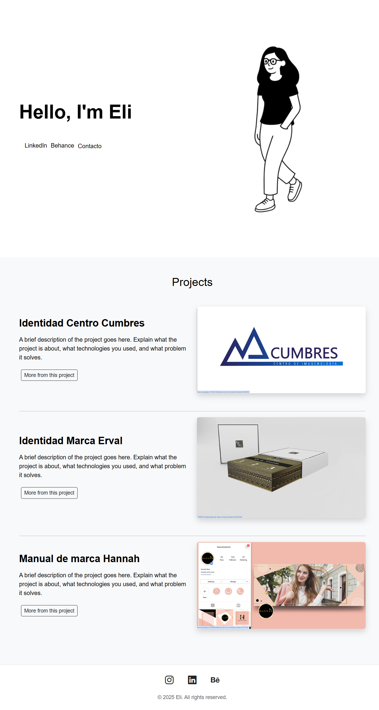

# Minimalist Portfolio – Hola Juniors Challenge

This project is part of a challenge from the **Hola Juniors** community, focused on building a minimalist web portfolio using HTML and CSS, with an emphasis on clean, responsive, and functional design.

## 📌 Challenge Objective

> Recreate a reference design with visual precision, simplicity, and elegance, showcasing previous works or projects in a clear and aesthetic structure.

## 🛠️ Technologies Used

- HTML5  
- CSS3  
- [Bootstrap](https://getbootstrap.com/)  
- Git and GitHub for version control

## ✨ Features

- Minimalist and responsive design  
- Clear sections: introduction, projects, and contact  
- Organized and semantic code  
- Mobile-friendly

## 📸 Preview
_A screenshot of the email design_  


## 🚀 How to Run the Project

1. Clone the repository:
   ```bash
   git clone https://github.com/JohtoSurfer/minimalist-portfolio-hola-juniors.git

